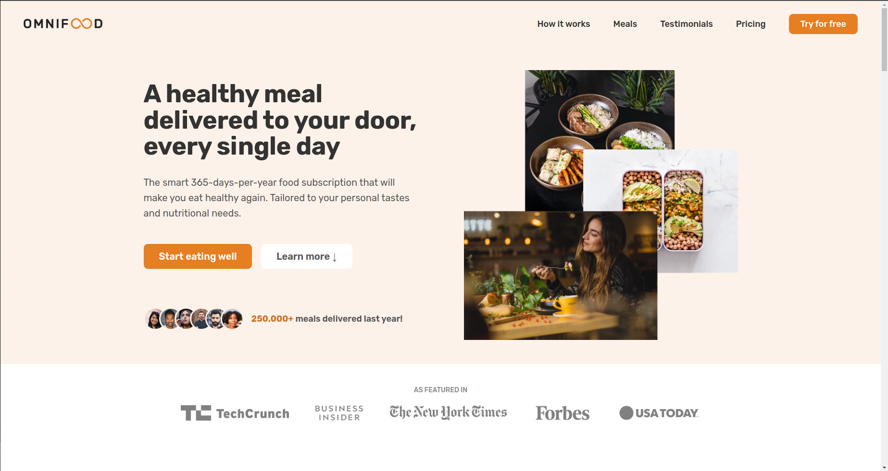

# Omnifood

### Responsive Omnifood Website

- Responsive Website Using HTML, CSS and Javascript.
- Compatible with all mobile devices and with a beautiful and pleasant user interface.

### The website contains:
- Hero section
- Featured in section
- How it works section
- Meals section
- Testimonials section
- Pricing section
- Call to action section
- Footer section

<!-- Notes -->

> You can do this project by following [This Course][course] by [Jonas Schmedtmann][jonas]...
>
> #### [View my certificate on UDEMY][certificate]
>
> #### [Live Demo][demo]

<!-- Links -->

[course]: https://www.udemy.com/course/design-and-develop-a-killer-website-with-html5-and-css3/
[jonas]: https://www.udemy.com/user/jonasschmedtmann/
[certificate]: https://www.udemy.com/certificate/UC-f6f8f768-fe8b-4fca-a3c6-061c706a41da/
[demo]: https://omnifood-muhammad.netlify.app/

<!-- Screen Shot -->

